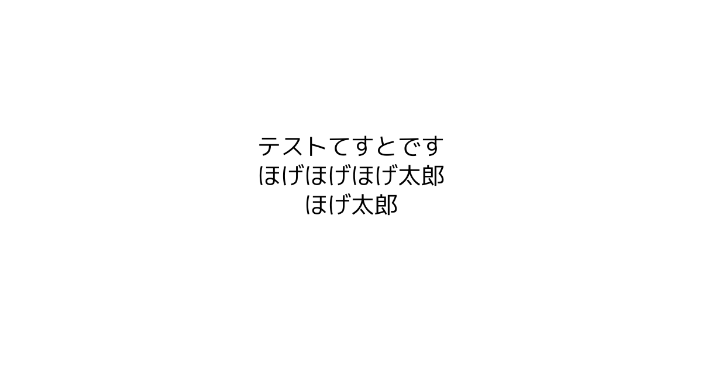

# str2img
This library generates images with embedded text for services like Question Box.

## sample
code: 
```
package main

import (
	"bytes"
	"fmt"

	"github.com/shimiwaka/str2img"
)

func main() {
	generator := &str2img.Generator{
		ImageHeight: 630,
		ImageWidth:  1200,
		FontSize:    40.0,
		FontFile:    "Koruri-Regular.ttf",
		ImageBytes:  &bytes.Buffer{},
	}

	err := generator.Generate("テストてすとです\nほげほげほげ太郎\nほげ太郎")
	if err != nil {
		fmt.Printf("%v", err)
	}

	err = generator.OutputImageFile("test.png")
	if err != nil {
		fmt.Printf("%v", err)
	}
}
```

result:

